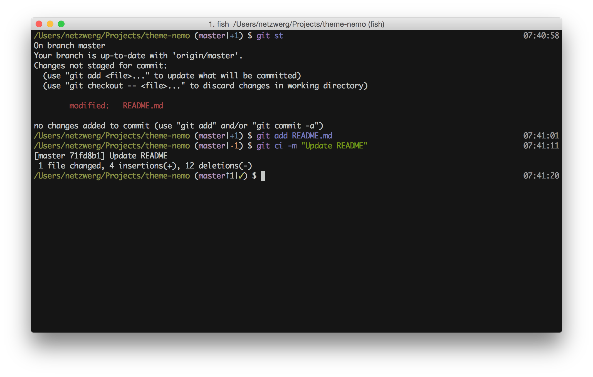

<div align="center">
  <a href="http://github.com/oh-my-fish/oh-my-fish">
  
  </a>
</div>
<br>

A dev-friendly theme for [Oh My Fish](http://github.com/oh-my-fish/oh-my-fish)

## Install


```fish
$ omf install https://github.com/netzwerg/theme-nemo
```

## Features

* Informative git prompt (branch / staging info) 
* Colors suitable for [iTerm](https://www.iterm2.com/) (particularly nice with my [hybrid](https://github.com/netzwerg/dotfiles/blob/zenmachine/Hybrid.terminal) scheme) 

## Screenshot

<p align="center">

</p>

# License

[MIT](LICENSE) © Rahel Lüthy 2015 
